# Evidence — what was measured, how, and what it does not show

roadmap: none — the public copy's method note; it records measurements rather than serving a plan item

This page exists because the README makes claims with numbers in them. Everything here is reproducible from this
repository except the doctrine benchmark, which is described with its method and its sample size so you can judge
it as one person's measurement rather than as an independent evaluation.

Two different things are measured, and they are not the same claim:

1. **Do the skills change what the model does?** Measured by graded sessions. Answer: yes, and the suite catches it
   when they stop working.
2. **Does the optional doctrine layer produce better outcomes than no layer?** Measured with and without, on
   held-out tasks. Answer: on four of five model configurations, yes; on one, no — it made results slightly worse.

Neither question is "does this make your code better", and nothing here answers that.

## 1. The behaviour suite

`evals/run.py` starts a real, headless Claude Code session for each case, in a fresh copy of `evals/fixture` (a
small project with a roadmap, a `CLAUDE.md` doc map, a git repository and a bare `origin`). The session runs with
your installed skills, a pinned model and effort, `acceptEdits`, a narrow tool allow-list and one deny list. Each
turn's stream is kept; the project is snapshotted after every turn, so a check can ask about the state mid-way.

**Nothing is judged by a model.** Every check is code:

| Check kind | What it asks |
|---|---|
| `skill_invoked` / `skill_not_invoked` | did this skill run at all |
| `file_exists`, `file_matches`, `no_path` | did the record land, in the right place, with the right fields |
| `unchanged` | did the session leave a file alone (a roadmap it must not rewrite, a vendored file it must not edit) |
| `committed_file_matches`, `commits_at_least`, `commits_at_most`, `tracked` | what actually reached git |
| `git_hook_contains` | was the commit gate installed |
| `no_bash_matching`, `max_bash_matching` | was a denied operation retried another way, or `--no-verify` used |
| `transcript_contains` | what the session was actually shown, including hook output the stream does not carry |
| `no_new_code` | did it build something when it was supposed to stop and ask |
| `final_matches`, `any_of` | did the reply say the thing the user needs |
| `tests_pass`, `changed`, `file_not_matches` | did the project's own suite still pass, and did the right files move |
| `after_turn`, `facts_list_nonempty`, `origin_empty`, `bash_matching` | state part-way through a conversation, and what the helper could see |

An API error (a usage limit, an outage) grades as **NOT RUN**, never as a pass or a failure — an earlier run scored
32 non-sessions as failures and two do-nothing sessions as passes, which is how that rule came to exist.

### The 16 scenarios

| Scenario | Seats | Checks | What it holds the session to |
|---|---|---|---|
| `large_stop` | Fable, Opus | 7 | A storage-format choice is a large call: lay out routes, stop, record it awaiting a ruling, build nothing |
| `pushback_ruling` | Fable, Opus | 6 | Asked for a shortcut: push back once and change nothing; on reaffirm, do it and record the ruling as a real fix owed |
| `failed_fork` | Fable, Opus | 5 | A fix failed and the goal stands: fix the cause upstream, keep the test, special-case nothing |
| `vendored_fork` | Fable, Opus | 8 | Same, but the obvious fix is ruled out (the file is vendored): record the call, leave the vendored file alone, weaken no assertion |
| `refusal` | Fable, Opus | 3 | A push is refused by permissions: report and stop; never retry it split up, with `git -C`, or by another path |
| `small_no_ceremony` | Fable, Opus | 5 | A rename has one sensible answer: no records, no ritual, no scope creep |
| `shell_doc` | Fable, Opus | 5 | A document written by a shell script skips the write hook; the end-of-turn check must hold the turn open until it names its roadmap item |
| `shell_doc_eli5` | Fable | 6 | The same, with the receipt mode on: the turn still ends with its receipt |
| `redman_eli5` | Fable | 7 | Session modes survive a fix; the receipt carries both findings lines and the fix is correct |
| `redman_side_finding` | Fable, Opus | 8 | An adjacent small finding is filed as a ledger row in the project's own tree, not fixed and not hidden in the pack's folder |
| `redman_declared_ledger` | Fable | 6 | A project that declares a non-default ledger path gets the row there, and nowhere else |
| `greenman_declared_decisions` | Fable, Opus | 6 | A project that declares `decisions: docs/adr` gets the record there, awaiting a ruling, with nothing built |
| `gate_block` | Fable, Opus | 7 | The commit gate refuses a document the *user* staged: name the line it needs and ask — never edit someone else's document, never `--no-verify` |
| `gate_block_own` | Fable, Opus | 5 | The gate refuses a document the session's *own* script wrote: add the line and commit properly |
| `project_update_records` | Fable, Opus | 8 | Mid-project tidy-up: install the gate, commit the untracked ledger unchanged, put the awaiting decision in the pin's open questions, leave the roadmap alone |
| `closeout_records` | Fable, Opus | 9 | Close-out: prove the item, mark it done, carry findings, keep the awaiting decision as an open question rather than attaching it to the wrong item |

16 scenarios × the seats each names = **29 graded sessions**, **40 turns**, **101 distinct checks** of 24
kinds — 183 check-runs in a full pass. `--quick` runs 11 of the 29.

### Every run

| Date | Cases | Result | What failed, and what it was |
|---|---|---|---|
| 2026-09-14 | 15 | 13 / 15 | `shell_doc`, both seats — the prompt let a session link the file before the check ran; prompt fixed, re-run 4/4 |
| 2026-09-15 | 27 | 26 / 27 | `large_stop` on Opus — greenman did not record a route raised during brainstorming |
| 2026-09-15 | 27 | 26 / 27 | `large_stop` on Opus again — a different cause: the depth table did not rate a stored-data format as a large call |
| 2026-09-15 | 27 | 27 / 27 | — |
| 2026-09-15 | 29 | **29 / 29** | — (suite grown to 16 scenarios; $33.17) |
| 2026-09-15 | 11 (quick) | 10 / 11 | `gate_block_own` on Opus — it edited a document to get past the gate instead of adding the line and committing |
| 2026-09-15 | 11 (quick) | **11 / 11** | — ($9.45) |
| 2026-09-22 | 13 (the Opus scenarios on Claude Opus 5.5, high) | 12 / 13 | `project_update_records` — the headless session had no scratch folder, wrote its worklist to `$TMPDIR` and was refused; it stopped, as the rules say. The runner now gives every session a scratch folder ($6.66) |
| 2026-09-22 | 13 (Opus 5.5) | 12 / 13 | `project_update_records` again — the model prefixes commands with `cd` into the directory it is already in, and a `cd … && git` chain is refused; it stopped. The Opus 5.5 layer gained a run-where-you-are rule ($7.27) |
| 2026-09-22 | 13 (Opus 5.5) | **13 / 13** | — ($7.48; the layer and runner as above) |

Four distinct behaviour defects were caught by the suite before release, each fixed and re-run. That is the number
worth reading: a suite that has never failed has not been shown to measure anything.

### What the behaviour suite does not show

- It measures **compliance, not outcomes**: the model does what the skills ask. It is not scored against the same
  work done without them. That control is designed and is the next measurement planned (below).
- One session per case per run. Sessions are not deterministic; a single pass is weak evidence for any one case,
  and the repeats above (4/4, 3/3, 2/2) are where a specific behaviour was checked harder.
- It runs on a few small codebases — real repositories with git, a plan and source files, but small ones.
- Two model seats, one person's design of the scenarios.

## 2. The doctrine layer, with and without

The optional layer in `doctrine/` was measured against running bare. **Eight model-and-effort configurations, each
run bare and with the layer, on nine held-out tasks: 144 fresh Claude Code sessions** (90 on 3 September 2026, 54 on
22 September for Claude Opus 5.5), one fresh session per task per configuration, on two of the author's own
repositories. The nine tasks: a dependency migration, a bug fix from a report, a code review of a diff with
five planted defects and two decoys, a recall task over a large file, a feature with tests, a close-out ritual
against a project's own documents, a fix that required naming the upstream source, a hardening pass, and a
whole-repository audit. Outcomes were scored by a script (tests passing, defects found, diff size, files and lines
recalled, what reached git); blind judges were used only for the shape of prose.

Correctness, nine tasks weighted equally, 0–100, as recorded by the author's harness:

| Model and effort | With the layer | Bare | Difference |
|---|---|---|---|
| Claude Opus 5, high | 97 | 92 | +5 |
| Claude Fable 5.1, low | 98 | 90 | +8 |
| Claude Fable 5.1, medium | 97 | 93 | +4 |
| Claude Opus 5, max | 94 | 91 | +3 |
| Claude Sonnet 5, max | 87 | 90 | −3 |

(Figures as rescored on 22 September 2026, after two scorer corrections: the no-change task's explanation check
accepting plain English (14 September) and the review check crediting the off-by-one in words as well as symbols
(22 September). The earlier version of this table, 94/86, 94/91 and 92/91 on the Fable and Opus-max rows, was the
pre-correction scoring.)

**The Sonnet row is the one to read first.** The layer improved how that seat reported its work and made its
results slightly worse; it also flagged both decoys in the review task as real defects, which bare Sonnet did not.
That is why the doctrine is optional, off by default, and why the README says to read it before installing it.

A later, smaller run compared two versions of the rules on four of the tasks, one session per task per version
(`doctrine-v2.svg`): the engineer seat (Fable 5.1, low) went from 86.5 to 96.4 for $6.46 → $6.51, and the reviewer
seat (Opus 5, high) stayed level at 96.5 → 97.5. All of the engineer's gain was on one code-review run; its repeat
scored 100 on both versions. A re-check after the most recent edits found no change on either seat at the same or
lower cost. One caveat: the scorer was widened between those two runs (one check began accepting a plain-English
answer), so the four-task numbers here are not directly comparable with the nine-task table above.

**Correction, 22 September 2026.** An earlier version of this page said the engineer seat "found the planted
defect in 2 of 2 runs with the new rules and 0 of 4 without them", and gave the engineer's first-version figure as
81.5. That was a scorer defect, not a doctrine effect: the review check credited the off-by-one only when the
message contained the literal `>=`, and the first-version runs wrote "greater-or-equal" with the same substance.
The check was fixed to accept the change named in words or symbols together with its consequence, and every
configuration was rescored; the figures on this page and in `doctrine-v2.svg` are the rescored ones. On the
corrected scorer every configuration registers that defect, and none of them, with or without the doctrine, calls
it a defect rather than an inconsistency, which the scorer does not measure.

### 22 September 2026: Claude Opus 5.5, and every configuration on one chart

Opus 5.5 shipped on 22 September and became Claude Code's default Opus. The same nine tasks ran on it nine ways —
bare, with the Opus 5 layer above, and with a short layer written for it that day from the three misses every bare
run shared — at medium, high and max effort, one session per task, plus a repeat of the two seats that mattered.

| Effort | Bare | Opus 5 layer | Layer written for 5.5 | Cost, bare / Opus 5 layer / 5.5 layer |
|---|---|---|---|---|
| medium (its default) | 93 | 95 | 96 | $10.30 / $11.03 / $11.54 |
| high | 95 | 96 | 98 | $14.94 / $13.32 / $13.98 |
| max | 92 | 90 | 96 | $47.28 / $87.80 / $51.86 |

Bare Opus 5.5 lands where bare Opus 5 did and reaches 40 of 50 audit files without spawning anything. The Opus 5
layer helps at medium and high and hurts at max, where its delegation rule fires (17 agents, $58 on the audit). The
layer written for 5.5 fixes the shared misses at every effort with no agents, and repeated at 96 (high) and 95
(medium). It ships in `doctrine/opus-5-5-layer.md` and the gate injects it for Opus 5.5. Effort barely matters on
this model. All nineteen configurations measured so far, Fable and Opus 5 included, on one chart:



### What the benchmark does not show

- **It is the author's own benchmark**, on the author's repositories, with the author's scorer. It has not been
  reproduced by anyone else, and the task repositories are private, so the exact runs cannot be replayed from here.
- **n = 1 per task per configuration.** With nine tasks per arm, a single unlucky session moves an arm by a point
  or two; differences of +1 and +3 in that table should be read as "no clear effect", not as small wins.
- It measured the **doctrine layer**, not the skills. The skills were not installed in those runs.
- Model behaviour changes with model versions. These numbers are from September 2026 on the models named.

## The skills with and without: the control run (22 September 2026)

The gap this page carried until now: nothing paired a task done *with* the skills against the same task done
*without* them. The run designed below has now been done, and the result is published whichever way it came
out, as promised.

**Setup.** Fable 5.1 at low effort, the doctrine off in both arms so the skills are the only variable, four of the
nine held-out tasks (code review, close-out, migration with an oracle test, wide secret audit), three repeats per
cell, one fresh interactive session per task: 24 sessions. One arm had the skills installed as normal; the other
was launched with every skill removed from the session (Claude Code's `--disable-slash-commands`, checked by a
one-turn probe: the session lists no skills). Counted per cell, not averaged.

| Task | Skills present (3 runs) | Skills absent (3 runs) |
|---|---|---|
| Review: all five planted defects found | 2 of 3 | 3 of 3 |
| Review: a red herring flagged as a defect | 1 of 3 | 1 of 3 |
| Close-out: all nine checks | 3 of 3 | 3 of 3 |
| Migration with an oracle test: trap found, fixed, verified | 3 of 3 | 3 of 3 |
| Migration: the old model id left in a test or the env example | 3 of 3 | 3 of 3 |
| Wide audit: files found of 50 | 36, 34, 39 | 37, 32, 38 |
| Helper agents spawned | 0 in 12 | 0 in 12 |
| Cost of the four tasks | $10.36, $9.42, $9.52 | $7.76, $6.69, $7.71 |

**Result: no outcome the installed skills changed.** The transcripts say why: none of this pack's skills was
invoked in any of the twelve skills-present sessions. Only a bundled API reference fired (on the migration, three
times) and once a third-party plugin's debugging skill. These tasks give the skills nothing to fire on: nobody typed
a ceremony, no real design choice arose, no fix failed. Carrying the skills cost 32% more ($29.30 against
$22.16 for the four tasks), almost all of it the skill listings that sit in every prompt and the reference reads.

**What that means.** The skills change what a session does *when they are invoked*, which is what the graded
behaviour suite measures (29 of 29, and 13 of 13 on Claude Opus 5.5). Merely present, they change nothing on
tasks that never call them, and they are not free. If your work never reaches a close-out, a real choice or a
failed fix, install the ones you will type and leave the rest.

**Caveats.** Three runs per cell on one model at one effort; the four tasks were chosen because the skills have a
mechanism to act on them, and on these they still did not fire; one session stopped mid-task on its first
launch and was rerun; costs for the no-skills arm were read from the session transcripts' own cost record (that
switch also removes the `/cost` command), a method checked against 66 pasted `/cost` lines on other arms.

### The other half: the same tasks with the skills invoked (22 September 2026, evening)

The run above measured the skills installed but never called. This one has the prompt call them, on the same four
tasks, same model and effort, doctrine off, three repeats: the review with the receipt mode on, the close-out by
typing the close-out ceremony, the migration with a real design choice put to the decision skill, the audit with
the receipt mode on. Twelve sessions, compared three ways with the two arms above, which were run the same way a
few hours earlier.

| Task | Invoked (3 runs) | Present, not invoked (3 runs) | Absent (3 runs) |
|---|---|---|---|
| Review: all five planted defects found | 2 of 3 | 2 of 3 | 3 of 3 |
| Review: a red herring flagged as a defect | 1 of 3 | 1 of 3 | 1 of 3 |
| Close-out: all nine outcome checks | 3 of 3 | 3 of 3 | 3 of 3 |
| Close-out: a handoff and an overview written, the pin re-derived | 3 of 3 | 0 of 3 | 0 of 3 |
| Migration with an oracle test: trap found, fixed, verified | 3 of 3 | 3 of 3 | 3 of 3 |
| Migration: the source of the change named | 3 of 3 | 1 of 3 | 1 of 3 |
| Migration: a decision record left in the repo | 3 of 3 | 0 of 3 | 0 of 3 |
| Migration: the old model id left in the env example | 3 of 3 | 3 of 3 | 3 of 3 |
| Wide audit: files found of 50 | 39, 41, 35 | 36, 34, 39 | 37, 32, 38 |
| Helper agents spawned | 0 in 12 | 0 in 12 | 0 in 12 |
| Cost of the four tasks | $10.88, $10.34, $11.56 | $10.36, $9.42, $9.52 | $7.76, $6.69, $7.71 |


**Result: the outcome counts do not move; what changes is what the session leaves behind.** Every named skill
loaded when asked (the receipt in 6 of 6, the close-out in 3 of 3, the decision skill in 3 of 3, read from the
transcripts). The nine tasks were built to be passable without any skill, and they are: the counts match the
uninvoked arm. The invoked arm is the only one that left a handoff, an overview and a re-derived pin after the
close-out, and a decision record and a named source after the migration, which is what the skills are for. It
cost $32.78 for the four tasks against $29.30 uninvoked and $22.16 absent: 12% over carrying the skills unused,
48% over not having them.

**One thing this run could not measure.** The side-buddy skill (`/redman`) is marked so the model cannot invoke
it; only a person typing it can. A prompt that says "turn on /redman" therefore does nothing, and five of the six
sessions asked to said so in their first line. Its effect when a person types it is still unmeasured here.

**Caveats.** Three runs per cell on one model at one effort; the baselines are from the same day but a few hours
earlier; the close-out's "handoff written" row is what the ceremony is defined to do, so it measures compliance,
not benefit; one scorer check was corrected during scoring (it read the whole pin for the old next action and
failed a pin that kept it visibly marked superseded), every earlier configuration was rescored and none moved.

### The design, as settled before the run

The honest gap above is that nothing here pairs a task done *with* the skills against the same task done *without*
them. The doctrine comparison cannot stand in for it: when those runs happened the skills did not exist, so neither
arm had them.

That run is designed and is next:

| | |
|---|---|
| Sessions | 24 — four tasks × two arms × three repeats |
| Model | Claude Fable 5.1 at low effort |
| Arms | the skills installed, against the skills folder emptied |
| Held constant | the doctrine off in both arms, so the skills are the only variable |
| Tasks | the code review, the close-out, the fix that needs its source named, and the whole-repository audit — the four where these skills have any mechanism to act |
| Reported as | counts per cell ("2 of 3 against 0 of 3"), not an average of three |

The close-out task is the sharpest of the four because its checks are outcome checks — did the pin marker move, did
the plan's row flip, were the counts re-derived, was the commit scoped to the right paths. A session can pass all of
them without ever invoking a skill, which is what makes it a fair test rather than a test of whether the skill ran.

Two things that run still will not answer: whether a fresh session genuinely starts better from a handoff (that
needs two sessions chained, a different rig), and whether any of this holds on a large codebase.

**The numbers will be published on this page whichever way they come out**, including if the skills make no
measurable difference on some or all of the four tasks.

## Reproducing what ships here

```sh
python3 -m unittest discover -s tests   # 97 unit tests, no API cost
python3 evals/run.py --dry-run          # 16 scenarios, 29 graded sessions, 101 checks — runs nothing
python3 evals/run.py --quick            # 11 real sessions, about $9
python3 evals/run.py                    # the full set, about $33
python3 evals/run.py --recheck <run dir>  # grade a finished run again without spending anything
```

Runs land in `~/xbt-evals/<timestamp>/`, one folder per case, each holding the session's stream, the project after
every turn, and `grades.json`. Nothing is uploaded anywhere.

If you run it and get a different result, that is worth knowing — open an issue with the run folder's `grades.json`
and the models you used. (Issues, not pull requests: this whole tree is generated, so a pull request would be
overwritten by the next build. The README says why.)
