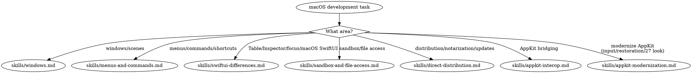

# macOS Development

This skill covers macOS-specific development: windows, menus, sandboxing, distribution, AppKit bridging, and macOS SwiftUI differences.

## Quick Reference

| Symptom / Task | Reference |
|----------------|-----------|
| Window management (WindowGroup, Window, MenuBarExtra, DocumentGroup) | See `skills/windows.md` |
| Menu bar, commands, keyboard shortcuts | See `skills/menus-and-commands.md` |
| Table, Inspector, NavigationSplitView, focus | See `skills/swiftui-differences.md` |
| App Sandbox, file access, security-scoped bookmarks | See `skills/sandbox-and-file-access.md` |
| Another team's app or app group container access denied without a prompt (`OS27`) | See `skills/sandbox-and-file-access.md` |
| Developer ID, notarization, Sparkle auto-updates | See `skills/direct-distribution.md` |
| NSViewRepresentable, NSHostingController, AppKit bridging, @Observable in AppKit, NSHostingMenu, SwiftUI scenes from AppKit | See `skills/appkit-interop.md` |
| Modernizing AppKit: mouseDown replacement, control events, status-item sessions, state restoration, concentric corners, touch (`OS27`) | See `skills/appkit-modernization.md` |

## Decision Tree

## Resources

**WWDC**: 2021-10062, 2022-10061, 2022-10075, 2023-10148, 2024-10149, 2026-272, 2026-289

**Docs**: /security/app-sandbox, /swiftui/windowgroup, /swiftui/table
